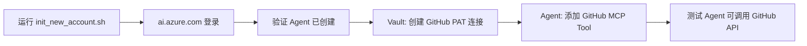

# micro-agent

**Azure AI Foundry Agent Demo** — 基于 Azure AI Foundry 构建的 Agent 框架，包含 Agent 客户端（.NET/React）和 MCP Tool Server（Python FastMCP）。


---

## 项目概述

本项目演示了如何在 Azure AI Foundry 上构建一个完整的 Agent 应用，包含两个核心服务和一个初始化工具：

| 组件 | 目录 | 部署目标 | 说明 |
|------|------|----------|------|
| **Agent Client** | `agent_client/` | Container App | .NET/React Web 应用 — 用户通过 OAuth (MSAL) 登录后，与 AI Foundry Agent 对话 |
| **MCP Server** | `mcp_server/` | Function App | Python FastMCP 服务 — 为 Agent 提供可调用的 Tool（snippet 管理、用户信息等） |
| **Setup Script** | `scripts/` | 本地运行 | 一键初始化/迁移脚本，创建全部 Azure 资源 |

### 架构

```
用户浏览器
   │
   ├─ MSAL (PKCE) OAuth 登录 ──→ Microsoft Entra ID
   │
   ▼
Agent Client (Container App, :8080)
   │  ASP.NET Core Backend + React Frontend
   │
   ├─ 用户 JWT → AI Foundry Agent API (Responses API / SSE)
   │
   ▼
AI Foundry Agent
   │
   ├─ MCP Tool 调用 (SSE) ──→ MCP Server (Function App)
   │                            │
   │                            ├─ hello_mcp / server_info
   │                            ├─ save_snippet / get_snippet / list_snippets
   │                            ├─ whoami / get_current_user (OBO → Graph)
   │                            └─ batch_save_snippets
   │
   ├─ GitHub MCP Tool ──────→ GitHub API (在 Portal 中配置)
   │    (via GitHub PAT / GitHub App, 凭证存储在 Vault)
   │
   ├─ (User-Assigned MI) ───→ Azure Container Registry / Storage
   │
   ├─ Vault ────────────────→ Azure Key Vault / AI Foundry Connection
   │    (存储 GitHub PAT、API Key 等敏感凭证)
   │
   └─ (OBO Token Exchange) → Microsoft Graph API
```

---

## 快速开始 — 新账号初始化

如果你需要将项目迁移到新 Azure 账号/订阅，使用一键初始化脚本：

```bash
# 预览将要创建的资源
bash scripts/init_new_account.sh --dry-run

# 交互式全自动创建
bash scripts/init_new_account.sh

# 跳过已存在的部分
bash scripts/init_new_account.sh --skip-foundry --skip-entra
```

脚本会依次进行：
1. **Phase 1:** 创建 Entra App Registration（Agent Client SPA + MCP Server API）
2. **Phase 2:** 创建 AI Foundry Hub（AI Services 资源），提示在门户创建 Project/Agent
3. **Phase 3:** 使用 `azd up` 部署 Container App（Agent Client 前后端）
4. **Phase 4:** 创建 Function App 并部署 MCP Server
5. **Phase 5:** 注册 MCP Tool 到 AI Agent
6. **Phase 6:** 生成本地 `.env` 文件

> 脚本运行**完成后**，还需在 AI Foundry Portal 中完成 GitHub MCP Tool 和 Vault 的配置（见下文）。

---

## 本地开发

### 前置条件

- Python 3.12+
- .NET 9.0 SDK（仅开发 Agent Client 时需要）
- Node.js 18+（仅开发前端时需要）
- Azure CLI (`az`)，已 `az login`
- Azure Functions Core Tools (`func`)
- Azure Developer CLI (`azd`)

### 环境准备

```bash
# 1. 克隆项目
git clone <repo-url> && cd micro-agent

# 2. 创建 Python 虚拟环境（MCP Server）
python -m venv .venv
source .venv/bin/activate
pip install -r requirements.txt

# 3. 从模板复制环境变量
cp .env.example .env
# 编辑 .env 填入实际值，或运行 init_new_account.sh 自动生成
```

### 配置 .env

最小配置（由 `init_new_account.sh` 自动填充）：

```ini
TENANT_ID=your-tenant-id
CLIENT_ID=your-agent-client-app-id
CLIENT_SECRET=your-agent-client-app-secret
MCP_SERVER_CLIENT_ID=your-mcp-server-app-id
MCP_SERVER_CLIENT_SECRET=your-mcp-server-app-secret
FOUNDRY_ACCOUNT_NAME=your-ai-foundry-hub-name
FOUNDRY_PROJECT_NAME=your-project-name
FOUNDRY_RESOURCE_GROUP=rg-ai-foundry-dev
AGENT_NAME=your-agent-name
AGENT_VERSION=latest
REDIRECT_URI=http://localhost:5000/callback
SCOPE=https://ai.azure.com/.default
```

### 启动 MCP Server（本地）

```bash
source .venv/bin/activate

# SSE 模式（默认）
python -m mcp_server
# → http://localhost:8000 (SSE: /sse, 健康检查: /health)

# Stdio 模式
MCP_TRANSPORT=stdio python -m mcp_server
```

### 启动 Agent Client（本地）

Agent Client 是 .NET/React 应用，位于 `agent_client/` 目录：

```bash
# 构建 .NET 后端
cd agent_client/backend/WebApp.Api
dotnet run
# → http://localhost:8080

# 另一个终端：启动 React 前端开发服务器
cd agent_client/frontend
npm install
npm run dev
# → http://localhost:5173
```

### 将 MCP Server 注册为 Agent Tool

```bash
# 指向本地 MCP Server
python scripts/register_agent_tool.py \
    --mcp-endpoint http://localhost:8000

# 生产环境（带 OAuth scope）
python scripts/register_agent_tool.py \
    --mcp-endpoint https://your-mcp-server.azurewebsites.net \
    --mcp-scope api://<mcp-server-app-id>/access_as_user
```

---

## 项目结构

```
micro-agent/
│
├── agent_client/                    # Agent 客户端 (.NET/React)
│   ├── backend/                     # ASP.NET Core 后端
│   │   ├── WebApp.Api/              # API 服务（Program.cs, Models, Services）
│   │   ├── WebApp.Api.Tests/        # 单元测试
│   │   └── WebApp.sln               # 解决方案文件
│   ├── frontend/                    # React 前端 (MSAL + Fluent UI)
│   │   ├── src/                     # 源码（组件、状态管理、工具函数）
│   │   ├── vite.config.ts           # Vite 构建配置
│   │   └── nginx.conf              # 生产 Nginx 配置
│   ├── infra/                       # Bicep 基础设施模板（azd 部署用）
│   │   ├── main.bicep              # 主模板
│   │   ├── main-infrastructure.bicep  # ACR + Container Apps 环境
│   │   ├── main-app.bicep          # Container App + 环境变量
│   │   └── entra-app.bicep         # Entra App Registration
│   ├── deployment/                  # azd 钩子脚本
│   │   ├── hooks/                   # predeploy / postprovision / preprovision
│   │   ├── docker/                  # Dockerfile
│   │   └── scripts/                 # 部署辅助脚本
│   ├── azure.yaml                   # azd 配置文件
│   └── ARCHITECTURE-FLOW.md         # 详细架构流程图
│
├── mcp_server/                      # MCP Server (Python FastMCP)
│   ├── __init__.py
│   ├── __main__.py                  # python -m mcp_server 入口
│   ├── server.py                    # FastMCP 服务创建 + 工具注册
│   ├── config.py                    # 环境配置加载（.env / 环境变量）
│   ├── tools/
│   │   ├── hello_tool.py           # hello_mcp / server_info
│   │   ├── snippet_tools.py        # 代码片段 CRUD
│   │   ├── user_info_tool.py       # 用户信息 / OBO Graph API
│   │   └── batch_tools.py          # 批量操作
│   └── auth/
│       ├── entra_auth.py           # Entra JWT 验证中间件 (ASGI)
│       └── obo_auth.py             # OBO Token 交换
│
├── function_app.py                  # Azure Functions ASGI 入口
├── host.json                        # Azure Functions 配置
├── requirements.txt                 # Python 依赖
│
├── scripts/                         # 基础设施脚本
│   ├── init_new_account.sh          # 一键初始化/迁移（推荐）
│   └── register_agent_tool.py       # 注册 MCP Server 到 AI Agent
│
├── .env.example                     # 环境变量模板
├── .funcignore                      # Functions 部署排除规则
└── README.md                        # 本文档
```

---

## 详解各组件

### 1. Agent Client (`agent_client/`)

ASP.NET Core 后端 + React 前端，使用 MSAL PKCE 流进行 OAuth 认证。用户在浏览器中通过 Microsoft 账号登录后，与 AI Foundry Agent 对话。

**后端端点：**

| 路由 | 方法 | 说明 |
|------|------|------|
| `/api/chat/stream` | POST | SSE 流式对话（核心接口） |
| `/api/health` | GET | 健康检查 |
| `/api/agent` | GET | Agent 元数据 |
| `/api/agent/info` | GET | Agent 配置信息 |
| `/api/conversations` | GET | 会话管理 |
| `/api/files/*` | GET | 文件下载 |

**前端关键特性：**

- MSAL PKCE OAuth + 托管标识双模式（开发/生产自动切换）
- SSE 流式对话渲染（Markdown + 代码高亮）
- MCP Tool 审批流程（用户可批准/拒绝 Tool 调用）
- 会话管理、文件附件、语音输入、Markdown 导出
- 基于 Fluent UI + react-copilot 构建

### 2. MCP Server (`mcp_server/`)

基于 FastMCP 构建的 Tool Server，部署为 Azure Functions（ASGI 模式）。

**工具清单：**

| 工具 | 说明 |
|------|------|
| `hello_mcp` | 基础问候，确认服务运行 |
| `server_info` | 服务器版本和可用工具列表 |
| `save_snippet / get_snippet` | 代码片段 CRUD |
| `list_snippets / delete_snippet` | 代码片段管理 |
| `get_snippet_with_metadata` | 片段 + 元数据 (JSON) |
| `whoami` | 从 Token 提取用户身份 |
| `get_current_user` | OBO 调用 Graph API 获取用户信息 |
| `batch_save_snippets / batch_get_snippets` | 批量操作 |

**OBO (On-Behalf-Of) 认证流程：**

当 Agent 调用 `get_current_user` 工具时：
1. Agent 将用户的 JWT 传递给 MCP Server
2. MCP Server 用该 Token 向 Microsoft Graph 发起请求
3. Graph 返回用户信息（displayName, email 等）

生产环境可启用托管标识 + Federated Identity Credential 实现真正的 OBO（参见 `mcp_server/auth/obo_auth.py`）。

### 3. Entra Auth 中间件

`function_app.py` 将 FastMCP 包装为 ASGI 应用，并添加 `EntraAuthMiddleware`：

- 所有 SSE 连接和工具调用请求均需携带有效的 Entra JWT（Bearer token）
- 从 JWT 的 `sub` / `upn` 声明提取用户身份
- 可选择开启/关闭（通过 `MCP_AUTH_ENABLED` 环境变量）

---

## AI Foundry Portal 配置

以下配置需要在 [ai.azure.com](https://ai.azure.com) 门户中手动完成，不会通过脚本自动化创建。

### GitHub MCP Tool

Agent 可以通过 MCP 协议调用 GitHub API，实现代码仓库操作、Issue 管理、PR 审查等功能。

**配置步骤：**

1. 进入 AI Foundry → Project → Agents → 选中你的 Agent → **Agents** → **Tools** 选项卡
2. 点击 **+ Add** → 选择 **MCP tool**（或 **Connection** 类型）
3. 填写以下信息：
   - **Name**: `github-mcp`（或自定义名称）
   - **Server URL**: 填入 GitHub MCP Server 地址
     - 使用 AI Foundry 内置的 GitHub 连接器，或自托管 GitHub MCP Server
   - **Authentication**: 选择对应的凭证/Vault 连接

**认证方式：**

| 方式 | 说明 | 适用场景 |
|------|------|----------|
| GitHub Personal Access Token (PAT) | `classic` 或 `fine-grained` token，需要 `repo`、`issues`、`pull_requests` 等权限 | 个人账号 |
| GitHub App | 通过 GitHub App 安装到组织，使用 JWT 认证 | 组织级 / 生产环境 |

> GitHub PAT 需要存储在 Vault 中，Agent 运行时从 Vault 读取凭证。

### Vault（连接/凭证管理）

AI Foundry 使用 **Vault**（即 Connections / Azure Key Vault）来安全存储 Agent 运行时需要的敏感凭证。

**配置步骤：**

1. 进入 AI Foundry → Project → **Settings** → **Connections**
2. 点击 **+ Create** → 选择凭证类型
3. 常见的 Vault 条目：

| 名称 | 类型 | 用途 |
|------|------|------|
| `github-pat` | API Key | GitHub MCP Tool 的 PAT 凭证 |
| `mcp-server-auth` | API Key | 调用自托管 MCP Server 的 OAuth scope / token |
| `azure-openai` | Azure OpenAI | 模型部署连接（通常自动创建） |

4. 也可以在 Azure Portal 中直接使用 **Key Vault** 创建 Secret，然后在 AI Foundry Connections 中关联

**Vault 在 Agent 调用链中的位置：**

```
Agent 执行 Tool 调用
    │
    ├─ 需要外部 API 凭证？
    │   ├─ 否 → 直接调用
    │   └─ 是 → 从 Vault 读取对应凭证
    │           │
    │           ├─ GitHub PAT → GitHub API
    │           ├─ MCP Server Auth → 自托管 MCP Server
    │           └─ 其他 API Key → 对应服务
    │
    └─ Agent 将工具结果返回给用户
```

### 在迁移脚本后补充配置

运行 `bash scripts/init_new_account.sh --env-name production` 之后，按以下顺序补充 Portal 配置：



---

## 部署到 Azure

### 一键部署（推荐）

```bash
bash scripts/init_new_account.sh
```

脚本会交互式引导完成全部 Azure 资源创建。部署完成后需补充 Portal 配置（见上方"AI Foundry Portal 配置"章节）。

### 分步部署

#### 部署 MCP Server（Azure Functions）

```bash
# 创建资源组 + Storage + Function App
az group create --name rg-mcp-server-dev --location eastus2
az storage account create --name mcpstoredev --resource-group rg-mcp-server-dev --location eastus2 --sku Standard_LRS
az functionapp create --name func-mcp-dev --resource-group rg-mcp-server-dev --storage-account mcpstoredev --consumption-plan-location eastus2 --runtime python --runtime-version 3.12 --functions-version 4 --os-type Linux

# 设置环境变量
az functionapp config appsettings set \
  --name func-mcp-dev --resource-group rg-mcp-server-dev \
  --settings \
    TENANT_ID=<tenant-id> \
    MCP_SERVER_CLIENT_ID=<mcp-app-id> \
    MCP_AUTH_AUDIENCE=api://<mcp-app-id> \
    MCP_AUTH_ENABLED=true \
    MCP_SERVER_HOST=0.0.0.0 \
    MCP_SERVER_PORT=8000 \
    MCP_TRANSPORT=sse

# 部署代码
cd <repo-root>
func azure functionapp publish func-mcp-dev --python
```

#### 部署 Agent Client（Azure Container Apps）

```bash
cd agent_client
azd env new dev --location eastus2
azd env set ENTRA_TENANT_ID <tenant-id>
azd env set AI_AGENT_ENDPOINT <foundry-project-endpoint>
azd env set AI_AGENT_ID <agent-name>
azd up
```

### 部署后配置

```bash
# 更新 Entra App Redirect URI（加入 Container App 的域名）
az ad app update \
  --id <agent-client-app-id> \
  --web-redirect-uris "http://localhost:5000/callback" "https://<container-app-url>/callback"

# 注册 MCP Tool
python scripts/register_agent_tool.py \
  --mcp-endpoint https://func-mcp-dev.azurewebsites.net/sse \
  --mcp-scope api://<mcp-server-app-id>/access_as_user \
  --agent-name <agent-name>
```

此外，还需在 [ai.azure.com](https://ai.azure.com) Portal 中补充：
- Vault 中创建 GitHub PAT 连接
- Agent Toolset 中添加 GitHub MCP Tool

---

## 迁移到新 Azure 账号

如果你的当前账号只有只读权限，需要在新的账号中重建整套环境：

1. 在新账号中登录 Azure CLI：
   ```bash
   az login --tenant <new-tenant-id>
   ```

2. 运行一键初始化脚本：
   ```bash
   bash scripts/init_new_account.sh --env-name production
   ```

3. 脚本运行期间需要：
   - 在 [https://ai.azure.com](https://ai.azure.com) 手动创建 Agent
   - 对 App Registration 授予 Admin Consent（如需）

4. 脚本运行完成后，补充 Portal 配置：
   - **Vault**: 创建 GitHub PAT 凭证连接
   - **Agent Toolset**: 添加 GitHub MCP Tool
   - 验证 Tool 连通性

5. 验证：
   ```bash
   # 检查 MCP Server
   curl -N https://func-mcp-<env>.azurewebsites.net/sse
   # 检查 Container App
   curl https://<container-app-url>/api/health
   ```

---

## 开发指南

### 验证 Import

```bash
source .venv/bin/activate
python -c "from mcp_server.server import create_app; app = create_app(); print('OK:', type(app).__name__)"
```

### 测试 MCP Server

```bash
python -m mcp_server &
sleep 2
curl -N http://localhost:8000/sse
# 或使用 MCP Inspector
npx @modelcontextprotocol/inspector http://localhost:8000
```

### 代码风格

```bash
pip install ruff
ruff check mcp_server/ scripts/
```

### Azure Functions 本地调试

```bash
func start
# → http://localhost:7071 (ASGI SSE 端点)
# → http://localhost:7071/health
```

---

## 许可证

MIT

## 参考项目

- [remote-mcp-functions-python](https://github.com/Azure-Samples/remote-mcp-functions-python) — MCP Tool Server 架构参考
- FunctionsMcpTool → `mcp_server/tools/*.py` — Tool 定义模式
- FunctionsMcpTool/hello_tool_with_auth → OBO 认证流程
